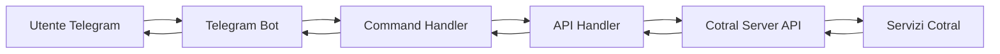

# 🚌 Cotral Telegram Bot

<div align="center">
  
</div>

<div align="center">


**Un bot Telegram intelligente per accedere in tempo reale alle informazioni del trasporto pubblico Cotral**

[Funzionalità](#-funzionalità) • [Installazione](#-installazione) • [Utilizzo](#-utilizzo) • [API](#-api-reference) • [Contribuire](#-contribuire)

</div>

---

## 📋 Indice

- [Panoramica](#-panoramica)
- [Funzionalità](#-funzionalità)
- [Requisiti di Sistema](#-requisiti-di-sistema)
- [Installazione](#-installazione)
- [Configurazione](#-configurazione)
- [Utilizzo](#-utilizzo)
- [Architettura](#-architettura)
- [API Reference](#-api-reference)
- [Sviluppo](#-sviluppo)
- [Troubleshooting](#-troubleshooting)
- [Contribuire](#-contribuire)
- [Roadmap](#-roadmap)
- [Licenza](#-licenza)

## 🎯 Panoramica

Cotral Telegram Bot è un'interfaccia conversazionale avanzata che permette agli utenti di accedere facilmente alle informazioni del trasporto pubblico Cotral direttamente da Telegram. Il bot offre un'esperienza utente intuitiva con menu interattivi, gestione dei preferiti e informazioni in tempo reale su paline, fermate, transiti e veicoli.

### ✨ Caratteristiche Principali

- 🚀 **Accesso Rapido**: Informazioni immediate su orari e transiti
- 📍 **Geolocalizzazione**: Trova paline e fermate vicine alla tua posizione
- ⭐ **Sistema Preferiti**: Salva le tue paline più utilizzate
- 🔄 **Aggiornamenti Real-Time**: Posizione veicoli e stato transiti in tempo reale
- 🎨 **UI Intuitiva**: Menu interattivi e navigazione semplificata
- 🔐 **Sessioni Persistenti**: Mantiene le preferenze utente

## 🚀 Funzionalità

### 🪧 Paline
| Funzione | Descrizione | Comando |
|----------|-------------|---------|
| **Preferiti** ✨ | Gestisci le tue paline salvate | `/getfavoritepoles` |
| **Ricerca Codice** 🔢 | Trova paline per codice | `/getpolesbycode` |
| **Ricerca Posizione** 📍 | Paline vicine a te | `/getpolesbyposition` |
| **Arrivo/Destinazione** 🚶🏁 | Collegamenti tra località | `/getpolebyarrivalanddestination` |
| **Destinazioni** 🚶 | Tutte le destinazioni da una località | `/getallpolesdestinationsbyarrival` |

### 🚏 Fermate
| Funzione | Descrizione | Comando |
|----------|-------------|---------|
| **Per Località** 🌐 | Tutte le fermate in una località | `/getstopsbylocality` |
| **Prima Fermata** ☝️ | Prima fermata disponibile | `/getfirststopbylocality` |

### 🚦 Transiti
| Funzione | Descrizione | Comando |
|----------|-------------|---------|
| **Per Palina** 🔢 | Orari e informazioni transiti | `/gettransitsbypolecode` |

### 🚎 Veicoli
| Funzione | Descrizione | Comando |
|----------|-------------|---------|
| **Tracking** 📍 | Posizione real-time del veicolo | `/getvehiclerealtimepositions` |

## 💻 Requisiti di Sistema

- **Node.js**: v16.0.0 o superiore
- **npm**: v8.0.0 o superiore
- **TypeScript**: v4.5.0 o superiore
- **RAM**: Minimo 512MB
- **Connessione Internet**: Stabile per comunicazione con API

## 📦 Installazione

### 1. Clona il Repository

```bash
git clone https://github.com/tuoutente/cotral-telegram-bot.git
cd cotral-telegram-bot
```

### 2. Installa le Dipendenze

```bash
npm install
```

### 3. Configura il Bot Telegram

1. Apri Telegram e cerca [@BotFather](https://t.me/botfather)
2. Crea un nuovo bot con `/newbot`
3. Scegli un nome e username per il bot
4. Copia il token fornito

### 4. Configura le Variabili d'Ambiente

```bash
# Crea il file .env
cp .env.example .env

# Modifica il file con il tuo editor preferito
nano .env
```

Contenuto del file `.env`:
```env
# Telegram Configuration
TELEGRAM_BOT_TOKEN=your_bot_token_here

# Server Configuration (opzionale)
API_BASE_URL=http://localhost:3000
NODE_ENV=production

# Session Configuration (opzionale)
SESSION_DB_PATH=./session_db.json
```

## ⚙️ Configurazione

### Server API

Il bot richiede il [Cotral Server API](https://github.com/ChromuSx/cotral-server-api) in esecuzione. 

1. **Configura l'URL del server** in `src/services/axiosService.ts`:
```typescript
const api = axios.create({
    baseURL: process.env.API_BASE_URL || 'http://localhost:3000',
});
```

2. **Verifica la connessione**:
```bash
curl http://localhost:3000/health
```

### Configurazione Avanzata

Per personalizzare ulteriormente il bot, modifica:

- `src/bot/bot.ts` - Logica principale e comandi
- `src/interfaces/` - TypeScript interfaces
- `src/apiHandlers/` - Gestori delle chiamate API

## 🎮 Utilizzo

### Avvio del Bot

#### Modalità Sviluppo
```bash
npm run dev
```

#### Modalità Produzione
```bash
npm run build
npm start
```

#### Con Docker
```bash
docker build -t cotral-bot .
docker run -d --name cotral-bot --env-file .env cotral-bot
```

### Interazione con il Bot

1. **Avvia una conversazione**: Cerca il tuo bot su Telegram e premi `/start`

2. **Navigazione Menu**: Usa i pulsanti interattivi per navigare

3. **Condivisione Posizione**: 
   - Tocca l'icona 📎 (graffetta)
   - Seleziona "Posizione"
   - Invia la tua posizione attuale

4. **Gestione Preferiti**:
   - Cerca una palina
   - Premi "Aggiungi ai preferiti ⭐"
   - Accedi rapidamente dal menu principale

## 🏗️ Architettura

```
cotral-telegram-bot/
│
├── src/
│   ├── bot/
│   │   ├── bot.ts              # Entry point del bot
│   │   ├── actions/            # Azioni del bot
│   │   └── handlers/           # Gestori eventi
│   │
│   ├── apiHandlers/            # Interfaccia con API Cotral
│   │   ├── polesApiHandler.ts
│   │   ├── stopsApiHandler.ts
│   │   ├── transitsApiHandler.ts
│   │   └── vehiclesApiHandler.ts
│   │
│   ├── commands/               # Definizioni comandi
│   ├── interfaces/             # TypeScript interfaces
│   ├── services/               # Servizi (axios, etc.)
│   └── utils/                  # Funzioni utility
│
├── tests/                      # Test suite
├── docs/                       # Documentazione
└── docker/                     # File Docker
```

### Flusso Dati



## 📚 API Reference

### Gestione Paline

```typescript
// Ottieni paline per codice
getPolesByCode(ctx: Context, code: string, params: { userId?: number }): Promise<void>

// Ottieni paline per posizione
getPolesByPosition(ctx: ExtendedContext, params: { 
    latitude: number, 
    longitude: number, 
    range?: number 
}): Promise<void>

// Gestione preferiti
addFavoritePole(ctx: Context, poleCode: string, stopCode: string, userId: number): Promise<void>
removeFavoritePole(ctx: Context, poleCode: string, userId: number): Promise<void>
```

### Gestione Transiti

```typescript
// Ottieni transiti per codice palina
getTransitsByPoleCode(ctx: Context, poleCode: string): Promise<void>
```

## 🛠️ Sviluppo

### Script Disponibili

```bash
# Sviluppo con hot-reload
npm run dev

# Build per produzione
npm run build

# Esegui test
npm test

# Linting
npm run lint

# Formattazione codice
npm run format
```

### Struttura Comandi

Per aggiungere un nuovo comando:

1. Definisci il comando in `src/commands/`
2. Crea l'handler in `src/apiHandlers/`
3. Registra l'azione in `src/bot/actions/`
4. Aggiungi al menu in `src/bot/bot.ts`

### Testing

```bash
# Test unitari
npm run test:unit

# Test integrazione
npm run test:integration

# Coverage
npm run test:coverage
```

## 🐛 Troubleshooting

### Problemi Comuni

| Problema | Soluzione |
|----------|-----------|
| **Token non valido** | Verifica il token nel file `.env` |
| **Connessione API fallita** | Controlla che il server API sia attivo |
| **Sessioni non persistenti** | Verifica permessi scrittura su `session_db.json` |
| **Posizione non funzionante** | Abilita GPS e permessi Telegram |

### Log e Debug

Abilita il debug verbose:
```bash
DEBUG=telegraf:* npm run dev
```

Controlla i log:
```bash
tail -f logs/bot.log
```

## 🤝 Contribuire

Accettiamo contributi! Ecco come partecipare:

1. **Fork** il repository
2. **Crea** un branch (`git checkout -b feature/AmazingFeature`)
3. **Commit** le modifiche (`git commit -m 'Add AmazingFeature'`)
4. **Push** al branch (`git push origin feature/AmazingFeature`)
5. **Apri** una Pull Request

### Linee Guida

- Segui lo stile di codice esistente
- Aggiungi test per nuove funzionalità
- Aggiorna la documentazione
- Usa commit semantici

## 📅 Roadmap

- [x] Implementazione base del bot
- [x] Sistema di preferiti
- [x] Geolocalizzazione
- [ ] Notifiche push per ritardi
- [ ] Supporto multilingua (EN, ES, FR)
- [ ] Pianificazione viaggi
- [ ] Integrazione pagamenti biglietti
- [ ] Dashboard web amministrativa
- [ ] Analytics utilizzo

## 📄 Licenza

Distribuito sotto licenza MIT. Vedi `LICENSE` per maggiori informazioni.

## 🙏 Riconoscimenti

- [Telegraf](https://telegraf.js.org/) - Framework Telegram Bot
- [Cotral Server API](https://github.com/ChromuSx/cotral-server-api) - API Backend
- Team Cotral per i servizi di trasporto

---

<div align="center">

**Sviluppato con ❤️ per i pendolari del Lazio**

[Segnala Bug](https://github.com/tuoutente/cotral-telegram-bot/issues) • [Richiedi Feature](https://github.com/tuoutente/cotral-telegram-bot/issues)

</div>
